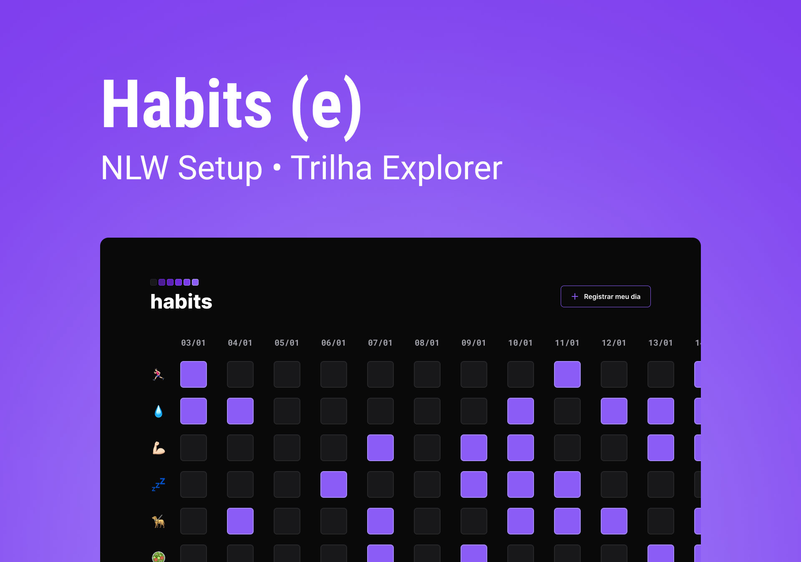

<h1 align=center>Habits</h1>

Esta é uma ferramenta de controle de hábitos.

Este projeto foi desenvolvido usando HTML, CSS e JavaScript. Este é um projeto que fiz acompanhando o NLW Setup da Rocketseat.

Visite o projeto online: https://robertobmjunior.github.io/nlwSetup/

O projeto é salvo no LocalStorage do navegador, por isso deve-se usar sempre o mesmo browser. Se for usado um novo navegador, será iniciado um novo rastreador de hábitos do zero. 

Figma: https://www.figma.com/community/file/1195327109778210238
